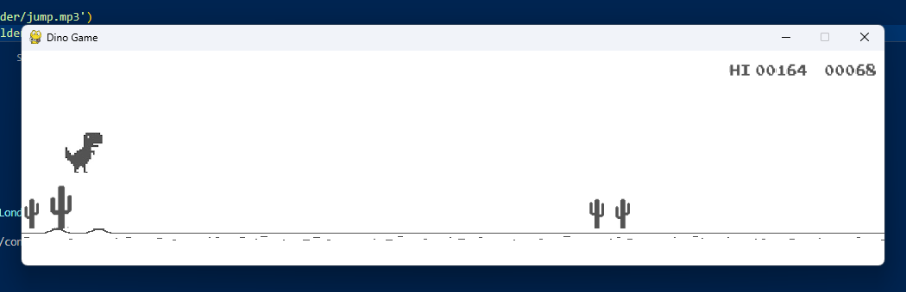

# Dino Game Remake

This program is a recreation of the chrome offline [dino game](chrome://dino), with leaderboards, logins, and admin functionalities.

# How to use
1. Install pygame (run 'pip install pygame' in terminal)
2. Run main
3. Login/Create account

# Features
- Saved scores 
- Leaderboards
- Admin accounts

# License
This project is licensed under the MIT [License](LICENSE)

# Contributors
- dogo1017
- AllyB23
- IREALLYREALLYLIKEMANGOES25
- TheCoolerRyan